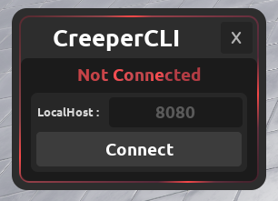
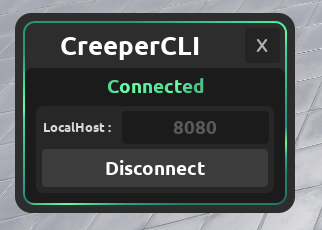
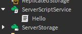

[](https://github.com/creepersaur/CreeperCLI-2/tree/master) [](https://create.roblox.com/store/asset/18662197402/CreeperCLI-2)

## What is it?
Have you ever wanted to push your script files from your computer to Roblox Studio directly?
Well with CreeperCLI, you can do that. It's extremely simple, and it's easier to use than Rojo.

## Supported FileTypes
#### `*.lua` ~~------------->~~ ModuleScript
#### `*.server.lua` ~~------>~~ Script
#### `*.client.lua` ~~------>~~ LocalScript
#### `*.json` ~~------------>~~ ModuleScript
*(JSON files will try to automatically be converted to modules.)*

## How do I use it?
It's really simple. Follow a few steps and you'll be right on track!
### Installation
- Get the CreeperCLI plugin from the [Roblox Creator Store](https://create.roblox.com/store/asset/18662197402/CreeperCLI-2).
- Get the latest release of the `.exe` file. By going to the [Releases](https://github.com/creepersaur/CreeperCLI-2/releases) tab. (Or from the source code)

> [!TIP]
> Keep in mind, that you can either put the `.exe` file inside the folder and run it, or do the following:
> - Download CreeperCLI.
> - Put it somewhere safe (where you won't delete it).
> - Add the directory path to your [Environment Variables](https://www.computerhope.com/issues/ch000549.htm).
> 
> Start/Restart the terminal and in your game's directory.
> Then use the exe's name (e.g. `creeper_cli`) to start the server.

### Running
- Create an empty folder
- Put the `.exe` inside (or use the tip above).
- Create a new `game` folder.
- Run the `.exe` **first**.
- Open the plugin from the Plugins tab, and click `Connect`.

> [!INFO]

> Attempting to connect the plugin before running the server will result in an error.

##### Not Connected vs. Connected:

 vs. 

## Game / Tree / Root
CreeperCLI uses a tree sort of interface. The same way that the Roblox Explorer does.

The `game` folder is the starting of the tree, or the `root`.

Any folders or scripts you add in here, will be translated to folders and scripts in Roblox Studio.
Hence if I wanted to put a script inside of `ServerScriptService`, I'd need to setup my tree like this:
```md
# game
  - ServerScriptService
      - Hello.server.luau
```
It would get translated to this in studio:



> [!CAUTION]
> If you spell a folder or file incorrectly, it will not line up correctly with in-game folders.
> 
> **CreeperCLI will create a new folder for any name it cannot find.**

## Compiling CreeperCLI
- Install rust + cargo (through rustup).
- Install Rust Visual Studio Prerequisites (rustup should've done that already).
- Download the source code and check if cargo is working (use `cargo init`).
- Run `cargo build` to compile it. (use `cargo run` to run the `.exe` immediately).
- The `.exe` file should be the `target/debug/creeper_cli.exe` file.

Have fun creating, and also report any issues on the [Issues](https://github.com/creepersaur/CreeperCLI-2/issues) tab or through the devforum post.
